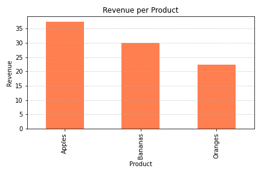
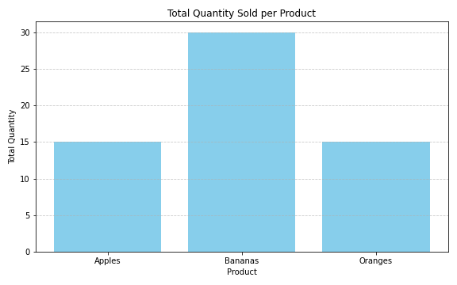

# 📊 Sales Data Analysis with SQLite & Python

This project demonstrates how to perform basic sales analysis using a small SQLite database (`sales_data.db`) and Python. It includes SQL queries for revenue, quantity, averages, and visualizations using `matplotlib`.

---

## 📁 Files

- `sales_data.db` - SQLite database file with a single `sales` table.
- `sales_analysis.py` or `sales_analysis.ipynb` - Python script/notebook performing analysis.
- `revenue_per_product.png` - Bar chart showing revenue per product.
- `quantity_per_product.png` - Bar chart showing quantity sold per product.
- `avg_units_sold.png` - Bar chart showing average units sold per product.

---

## 📦 Requirements

Install required packages using pip:

```bash
pip install pandas matplotlib
```

All other packages (`sqlite3`) are part of the Python standard library.

---

## 🧠 Dataset Structure

Table: `sales`

| Column   | Type    | Description                |
|----------|---------|----------------------------|
| id       | INTEGER | Unique ID for each sale    |
| product  | TEXT    | Name of the product sold   |
| quantity | INTEGER | Number of units sold       |
| price    | REAL    | Price per unit             |

---

## 🚀 How to Run

1. Clone the repo or download the files.
2. Ensure `sales_data.db` is in the same directory.
3. Run the script:

```bash
python sales_analysis.py
```

Or open the notebook in Jupyter:

```bash
jupyter notebook sales_analysis.ipynb
```

---

## 📈 Features / Queries Used

- Total revenue per product
- Total quantity sold per product
- Average units sold per product
- Number of transactions per product
- Bar chart visualizations using `matplotlib`

---

## 📊 Sample Output

### Revenue per Product


### Quantity per Product


---

## 🧪 Sample SQL Queries

```sql
-- Total Revenue
SELECT product, SUM(quantity * price) AS revenue FROM sales GROUP BY product;

-- Average Quantity
SELECT product, AVG(quantity) AS avg_units_sold FROM sales GROUP BY product;

-- Transaction Count
SELECT product, COUNT(*) AS num_transactions FROM sales GROUP BY product;
```

---

## 🛠️ Author & Credits

**Author:** Surjeetsinh Nandkumar Thakur  

---

## 📜 License

This project is for educational and demonstration purposes only.
